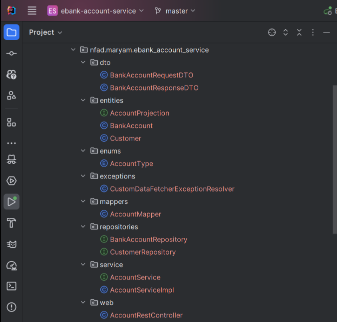
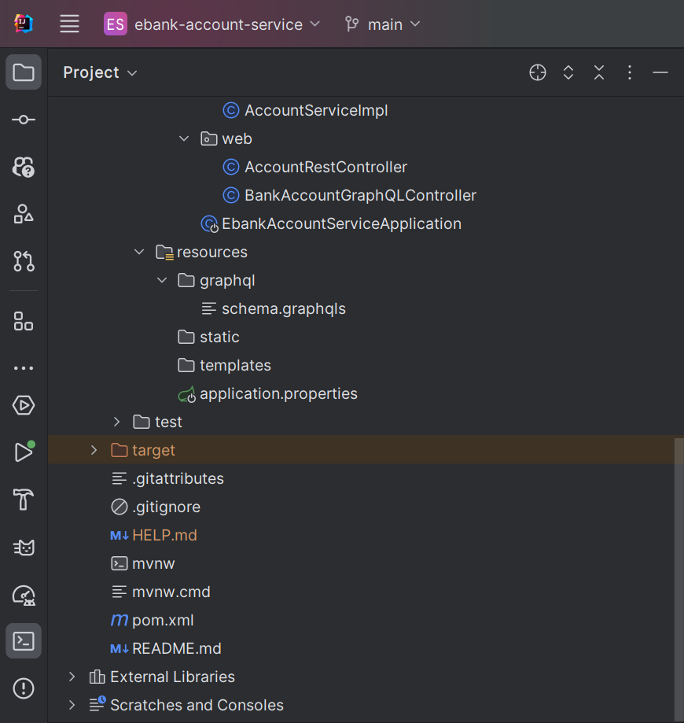

# TP : Microservice de Gestion de Comptes Bancaires

Ce projet est un exemple de microservice développé avec Spring Boot pour gérer des comptes bancaires. Le projet utilise plusieurs concepts tels que JPA, GraphQL, Spring Data Rest et OpenAPI pour exposer les APIs.

---
## Objectifs

1. **Créer un microservice Spring Boot**.
2. Ajouter des fonctionnalités pour gérer les comptes bancaires :
    - CRUD des comptes bancaires.
    - API REST et documentation Swagger.
    - API GraphQL.
3. Tester avec un client REST comme Postman.
4. Générer des projections et exploiter les DTOs avec des mappers.


## Technologies utilisées

- Spring Boot 3.3.5
- Spring Data JPA
- Base de données H2
- Lombok
- Spring Doc OpenAPI UI
- GraphQL

## Étapes du TP

### 1. Création du projet

Créer un projet Spring Boot avec les dépendances suivantes :
- **Spring Web**
- **Spring Data JPA**
- **Spring Data REST**
- **H2 Database**
- **Lombok**
- **Spring GraphQL**
- **Springdoc OpenAPI UI**

## Structure du projet

Le projet est organisé selon l'architecture suivante :




## Étapes de réalisation

### 1. Création du projet Spring Boot

Création d'un projet Spring Boot avec les dépendances :
- Spring Web
- Spring Data JPA
- H2 Database
- Lombok
- Spring Doc OpenAPI

[Capture d'écran de la création du projet]


### 2. Création de l'entité JPA Account

```java


