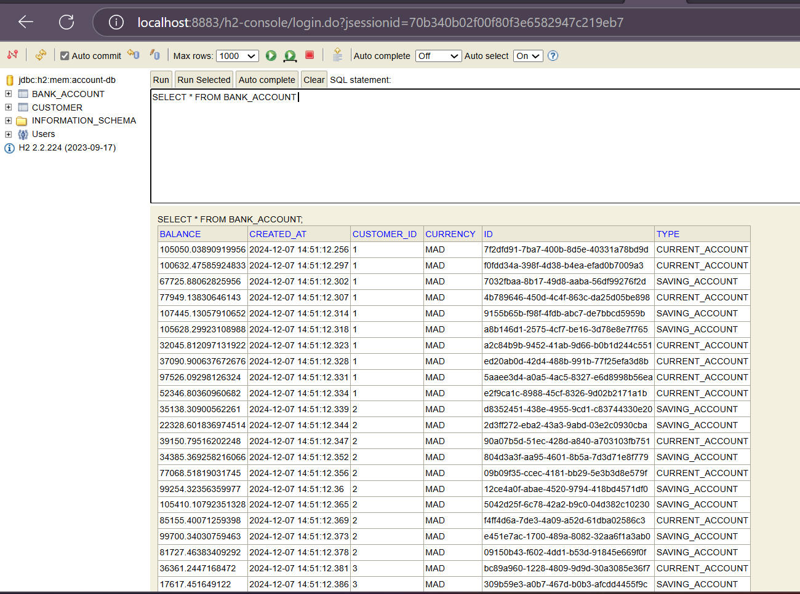
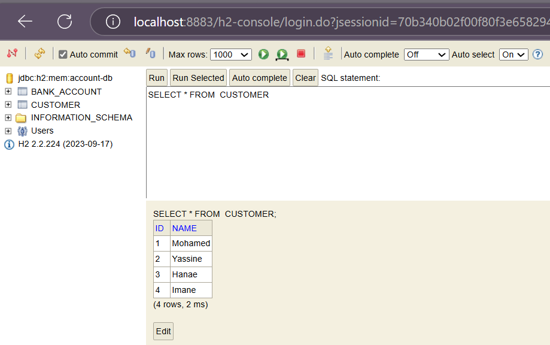
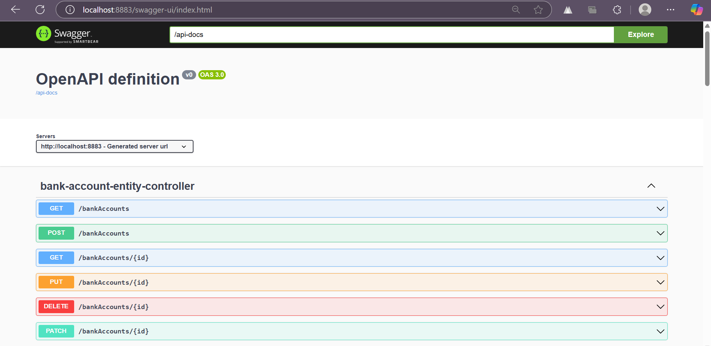

# TP : Microservice de Gestion de Comptes Bancaires

Ce projet est un exemple de microservice développé avec Spring Boot pour gérer des comptes bancaires. Le projet utilise plusieurs concepts tels que JPA, GraphQL, Spring Data Rest et OpenAPI pour exposer les APIs.

---
## Objectifs

1. **Créer un microservice Spring Boot**.
2. Ajouter des fonctionnalités pour gérer les comptes bancaires :
    - CRUD des comptes bancaires.
    - API REST et documentation Swagger.
    - API GraphQL.
3. Tester avec un client REST comme Postman.
4. Générer des projections et exploiter les DTOs avec des mappers.


## Technologies utilisées

- Spring Boot 3.3.5
- Spring Data JPA
- Base de données H2
- Lombok
- Spring Doc OpenAPI UI
- GraphQL

## Étapes du TP

###  Création du projet

Créer un projet Spring Boot avec les dépendances suivantes :
- **Spring Web**
- **Spring Data JPA**
- **Spring Data REST**
- **H2 Database**
- **Lombok**
- **Spring GraphQL**
- **Springdoc OpenAPI UI**

## Structure du projet

Le projet est organisé selon l'architecture suivante :


## Étapes de réalisation

### 1. Création du projet Spring Boot

Création d'un projet Spring Boot avec les dépendances :
- Spring Web
- Spring Data JPA
- H2 Database
- Lombok
- Spring Doc OpenAPI

### Création de l'entité JPA Account

```java
@Entity
@Data
@NoArgsConstructor @AllArgsConstructor @Builder
public class BankAccount {
    @Id
    private String id;
    private Date createdAt;
    private Double balance;
    private String currency;
    @Enumerated(EnumType.STRING)
    private AccountType type;
    @ManyToOne
    private Customer customer;

}
```


```java
@Entity

@NoArgsConstructor
@AllArgsConstructor
@Data
@Builder
public class Customer {
@jakarta.persistence.Id
@Id
@GeneratedValue(strategy = GenerationType.IDENTITY)
private Long id;
private String name;
@OneToMany(mappedBy = "customer")
@JsonProperty(access = JsonProperty.Access.WRITE_ONLY)
private List<BankAccount> bankAccounts;

}
```
### Création du Repository
```java
@RepositoryRestResource
public interface BankAccountRepository extends JpaRepository<BankAccount,String> {
@RestResource(path = "/byType")
List<BankAccount> findByType(@Param("t") AccountType type);

}
```
```java
public interface CustomerRepository extends JpaRepository<Customer,Long> {
}
```
### application properties 
```
spring.application.name=ebank-account-service
spring.datasource.url=jdbc:h2:mem:account-db

spring.h2.console.enabled=true

server.port=8883

# Swagger UI custom path
springdoc.swagger-ui.path=/swagger-ui.html

# API docs properties
springdoc.api-docs.path=/api-docs
springdoc.show-actuator=true
spring.graphql.graphiql.enabled=true
```

### Test de la couche DAO
```java
@SpringBootApplication
public class EbankAccountServiceApplication {

	public static void main(String[] args) {

		SpringApplication.run(EbankAccountServiceApplication.class, args);
	}
	@Bean
	CommandLineRunner start(BankAccountRepository bankAccountRepository, CustomerRepository customerRepository){
		return args -> {
			Stream.of("Mohamed","Yassine","Hanae","Imane").forEach(c->{
				Customer customer = Customer.builder()
						.name(c)
						.build();
				customerRepository.save(customer);
			});
			customerRepository.findAll().forEach(customer -> {
				for(int i = 0; i<10 ;i++){
					BankAccount bankAccount=BankAccount.builder()
							.id(UUID.randomUUID().toString())
							.type(Math.random()>0.5? AccountType.CURRENT_ACCOUNT:AccountType.SAVING_ACCOUNT)
							.balance(10000+Math.random()*98008)

							.createdAt(new Date())
							.currency("MAD")
							.customer(customer)
							.build();
					bankAccountRepository.save(bankAccount);

				}
			});


		};
	}
}
```



### DTOs et Mappers
```java
@Data
@NoArgsConstructor
@AllArgsConstructor
@Builder
public class BankAccountRequestDTO {
private Double balance;

    private String currency;
    private AccountType type;
}


@Data @NoArgsConstructor @AllArgsConstructor @Builder
public class BankAccountResponseDTO {
private String id;
private Date createdAt;
private Double balance;
private String currency;
private AccountType type;
}
```

###  Couche Service
#### Interface du service
```java
public interface AccountService {
public BankAccountResponseDTO addAccount(BankAccountRequestDTO bankAccountDTO);

    BankAccountResponseDTO updateAccount(String id, BankAccountRequestDTO bankAccountDTO);
}
```
#### Implémentation du service
```java
@Service
@Transactional
public class AccountServiceImpl implements AccountService {
@Autowired
private BankAccountRepository bankAccountRepository;
@Autowired
private AccountMapper accountMapper;
@Override
public BankAccountResponseDTO addAccount(BankAccountRequestDTO bankAccountDTO) {
BankAccount bankAccount= BankAccount.builder()
.id(UUID.randomUUID().toString())
.createdAt(new Date())
.balance(bankAccountDTO.getBalance())
.type(bankAccountDTO.getType())
.currency(bankAccountDTO.getCurrency())
.build();
BankAccount saveBankAccount = bankAccountRepository.save(bankAccount);
BankAccountResponseDTO bankAccountResponseDTO = accountMapper.fromBankAccount(saveBankAccount);

        return bankAccountResponseDTO;
    }

    @Override

    public BankAccountResponseDTO updateAccount(String id, BankAccountRequestDTO bankAccountDTO) {
        BankAccount bankAccount = BankAccount.builder()
                .id(id)
                .createdAt(new Date())
                .balance(bankAccountDTO.getBalance())
                .type(bankAccountDTO.getType())
                .currency(bankAccountDTO.getCurrency())
                .build();
        BankAccount saveBankAccount = bankAccountRepository.save(bankAccount);
        BankAccountResponseDTO bankAccountResponseDTO = accountMapper.fromBankAccount(saveBankAccount);
        return bankAccountResponseDTO;
    }

}

```
### Création du RestController

```java
@RestController
@RequestMapping("/api")
public class AccountRestController {
private BankAccountRepository bankAccountRepository;
private AccountService accountService;
private AccountMapper accountMapper;
public AccountRestController(BankAccountRepository bankAccountRepository, AccountService accountService, AccountMapper accountMapper) {
this.bankAccountRepository = bankAccountRepository;
this.accountService = accountService;
this.accountMapper = accountMapper;
}

    @GetMapping("/bankAccounts")
    public List<BankAccount> bankAccounts() {
        return bankAccountRepository.findAll();
    }

    @GetMapping("/bankAccounts/{id}")
    public BankAccount bankAccount(@PathVariable String id) {
        return bankAccountRepository.findById(id)
                .orElseThrow(() -> new RuntimeException(String.format("Account %s not found", id)));


    }

    @PostMapping("/bankAccounts")
    public BankAccountResponseDTO save(@RequestBody BankAccountRequestDTO requestDTO) {

        return accountService.addAccount(requestDTO);
    }
    @PutMapping("/bankAccounts/{id}")
        public BankAccount update(@PathVariable String id,@RequestBody BankAccount bankAccount){
            BankAccount account=bankAccountRepository.findById(id).orElseThrow();
            if (bankAccount.getBalance()!=null) account.setBalance(bankAccount.getBalance());
            if (bankAccount.getCreatedAt()!=null) account.setCreatedAt(new Date());
            if (bankAccount.getType()!=null) account.setType(bankAccount.getType());
            if (bankAccount.getCurrency()!=null) account.setCurrency(bankAccount.getCurrency());
            return bankAccountRepository.save(account);

        }
    @DeleteMapping("/bankAccounts/{id}")
    public void deleteAccount(@PathVariable String id) {
        bankAccountRepository.deleteById(id);
    }
}
```

```java

@Controller
public class BankAccountGraphQLController {
    @Autowired
    private BankAccountRepository bankAccountRepository;
    @Autowired
    private AccountService accountService;
    @Autowired
    private CustomerRepository customerRepository;
    @QueryMapping
    public List<BankAccount> accountsList() {
        return bankAccountRepository.findAll();
    }
    @QueryMapping
    public BankAccount bankAccountById(@Argument String id) {
        return bankAccountRepository.findById(id)
                .orElseThrow(() -> new RuntimeException(String.format("Account %s[not found", id)));

    }

    @MutationMapping
    public BankAccountResponseDTO addAccount(@Argument BankAccountRequestDTO bankAccount) {
        return accountService.addAccount(bankAccount);
    }

    @MutationMapping
    public BankAccountResponseDTO updateAccount(@Argument String id ,@Argument BankAccountRequestDTO bankAccount) {
        return accountService.updateAccount(id,bankAccount);
    }

    @MutationMapping
    public void deleteAccount(@Argument String id ) {
        bankAccountRepository.deleteById(id);

    }
    @QueryMapping
    public List<Customer> customers(){
        return customerRepository.findAll();
    }


}

```

APIs Disponibles
REST Endpoints
GET /api/accounts : Liste tous les comptes
GET /api/accounts/{id} : Récupère un compte par ID
POST /api/accounts : Crée un nouveau compte
PUT /api/accounts/{id} : Met à jour un compte
DELETE /api/accounts/{id} : Supprime un compte

###  Documentation OpenAPI/Swagger
URL de la documentation Swagger : http://localhost:8883/swagger-ui.html


### API GraphQL
#### Schéma GraphQL
```
type Query{
accountsList : [BankAccount]
bankAccountById(id:String) : BankAccount
customers : [Customer]
}
type Mutation {
addAccount(bankAccount : BankAccountDTO) : BankAccount,
updateAccount(id : String, bankAccount : BankAccountDTO):BankAccount,
deleteAccount(id : String) : String
}

type Customer {
id : ID,
name:String,
bankAccounts : [BankAccount]
}

type BankAccount{
id : String,
createdAt : Float,
balance : Float,
currency : String,
type : String,
customer: Customer

}

input BankAccountDTO{
balance : Float,
currency : String,
type : String
}
```
### Pour Accéder : 

H2 Console : http://localhost:8883/h2-console
Swagger UI : http://localhost:8883/swagger-ui.html
GraphQL Playground : http://localhost:8883/graphiql
